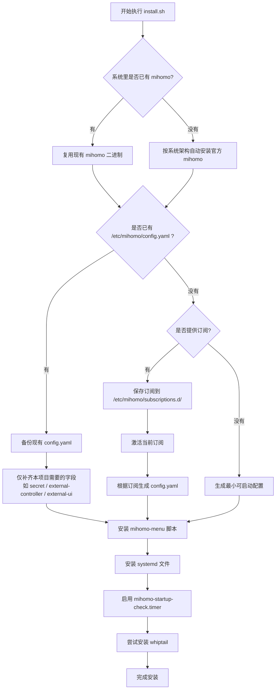

# mihomo-menu

[中文 README](./README.md) | [English README](./README_EN.md)

一个面向 Linux / SSH / 无图形环境的 Mihomo 命令行管理工具集。

这个项目的出发点很简单：

- 很多服务器只有命令行，没有桌面环境
- `metacubexd` / WebUI 适合切换**当前订阅下的节点**
- 但在终端里管理**多个机场订阅源**、测速、切换节点、做开机自检，往往不够顺手

所以有了这个项目。

## 功能

- 交互式菜单：`mihomo-menu`
- 多订阅管理：
  - `mihomo-sub-add`
  - `mihomo-sub-list`
  - `mihomo-sub-current`
  - `mihomo-sub-use`
- 节点管理：
  - `mihomo-list`
  - `mihomo-current`
  - `mihomo-select`
  - `mihomo-select-index`
- 节点测速：
  - `mihomo-delay`
  - 支持按测速排名直接切换
- 代理测试：
  - `mihomo-test`
- WebUI 更新：
  - `mihomo-ui-update`
- 当前订阅更新：
  - `mihomo-update`
- 开机健康检查：
  - `mihomo-startup-check.sh`
  - `mihomo-startup-check.timer`

## 适用场景

- Ubuntu / Debian / CentOS / Rocky / AlmaLinux / Fedora / Arch / Alpine 等常见 Linux
- 通过 SSH 远程管理 Mihomo
- 没有图形界面
- 想保留 WebUI，但又希望 CLI 能做多订阅切换和批量操作

## 一键安装

在目标机器上执行：

```bash
curl -fsSL https://raw.githubusercontent.com/sunset-move/mihomo-menu/main/install.sh | sudo bash
```

这个安装脚本会：

1. 下载当前仓库
2. 检测系统中是否已有 `mihomo`
3. 如果没有，自动安装官方 Mihomo 核心
4. 把脚本安装到 `/usr/local/bin/`
5. 把 systemd 文件安装到 `/etc/systemd/system/`
6. 自动创建：
   - `/etc/mihomo/subscriptions.d`
   - `/etc/mihomo/secret.key`（如果不存在）
7. 尝试安装 `whiptail`（可选，失败不影响基本功能）
8. 启用开机健康检查 timer

### 无人值守安装时传入订阅

如果你想在安装时直接带上订阅：

```bash
curl -fsSL https://raw.githubusercontent.com/sunset-move/mihomo-menu/main/install.sh | \
sudo env MIHOMO_SUBSCRIPTION_NAME=airport1 MIHOMO_SUBSCRIPTION_URL='你的订阅链接' bash
```

## 前置要求

这个项目主要是管理层，但安装脚本现在会先做：

1. 检测系统中是否已有 `mihomo`
2. 如果没有，则自动安装官方 Mihomo 核心

不过你仍然需要理解一个边界：

- 这套工具负责**管理、订阅切换、测速、健康检查**
- 不负责替你生成完整可用的业务规则配置逻辑

推荐的目标环境：

- Mihomo 主配置目录：`/etc/mihomo/`
- Mihomo 控制 API 可用
- 你已经准备好自己的基础配置/订阅来源

### 现在的自动化边界

安装脚本现在支持：

1. 如果系统里已经有 `mihomo`
   - 直接复用现有 Mihomo
   - 尽量沿用已有 `/etc/mihomo/config.yaml`
   - 会先备份，再补齐 `secret` / `external-controller` / `WebUI` 相关字段

2. 如果系统里没有 `mihomo`
   - 自动安装官方 Mihomo 核心
   - 自动创建 `mihomo.service`

3. 如果已经有 `config.yaml`
   - 先备份原始配置
   - 再进行最小必要的接入修改

4. 如果没有 `config.yaml`
   - 若你传入了订阅，则直接根据订阅生成配置
   - 若没有订阅，则先生成一个最小可启动配置

也就是说：

- **已有环境**：尽量沿用并接入
- **没有环境**：自动拉起一套可运行的基础系统

### 安装流程图



## 当前目录结构

```text
scripts/
  mihomo-menu.sh
  mihomo-main-group.py
  mihomo-list.sh
  mihomo-current.sh
  mihomo-select.sh
  mihomo-select-index.sh
  mihomo-delay.py
  mihomo-test.sh
  mihomo-sub-add.sh
  mihomo-sub-list.sh
  mihomo-sub-current.sh
  mihomo-sub-use.sh
  mihomo-sub2config.py
  mihomo-update.sh
  mihomo-ui-update.sh
  mihomo-startup-check.sh

systemd/
  mihomo-startup-check.service
  mihomo-startup-check.timer
```

## 快速开始

### 1. 添加第一个订阅

```bash
mihomo-sub-add airport1 '你的订阅链接'
```

### 2. 切换到这个订阅

```bash
mihomo-sub-use airport1
```

### 3. 打开交互式菜单

```bash
mihomo-menu
```

### 4. 手动测速

```bash
mihomo-delay --timeout 4000
```

### 5. 一键切到最快节点

```bash
mihomo-delay --timeout 4000 --select 1
```

## WebUI 和本项目的关系

`metacubexd` / WebUI 适合做：

- 查看当前节点
- 切换当前订阅里的节点
- 看连接
- 看日志
- 看流量

但它**不适合直接切换多个机场订阅源**。

因为“切机场”不只是换节点，而是：

1. 切换当前订阅文件
2. 重生成 `config.yaml`
3. 重启 Mihomo

所以：

- 节点管理：WebUI 很方便
- 订阅源切换：`mihomo-menu` / `mihomo-sub-use` 更合适

## 支持的订阅格式

当前脚本支持：

1. `base64 + vmess://...` 原始订阅
2. 完整 `Clash YAML` 订阅

不保证 100% 通吃所有格式，尤其是未来新的混合格式：

- `vless://`
- `trojan://`
- `hysteria://`
- `tuic://`

如果遇到新格式，可能需要继续扩展 `mihomo-sub2config.py`。

## 菜单说明

`mihomo-menu` 支持两种交互模式：

1. 如果系统有 `whiptail`
   - 优先使用类对话框菜单
   - 闪烁更少
   - 支持上下键

2. 如果终端兼容性较差
   - 自动退回成普通数字菜单
   - 至少能稳定使用

节点选择时：

- 支持上下键选择
- 显示最近延迟
- 支持 `Esc` 退出

## 开机健康检查

安装后会启用：

- `mihomo-startup-check.timer`

日志文件：

```text
/var/log/mihomo-startup-check.log
```

手动立即跑一次：

```bash
sudo systemctl start mihomo-startup-check.service
```

看日志：

```bash
tail -n 50 /var/log/mihomo-startup-check.log
```

## 常用命令

```bash
mihomo-menu
mihomo-sub-list
mihomo-sub-current
mihomo-sub-use airport1
mihomo-list
mihomo-current
mihomo-delay --timeout 4000
mihomo-delay --timeout 4000 --select 1
mihomo-test
mihomo-update
mihomo-ui-update
```

## 安全说明

- 不要把真实订阅链接提交到公开仓库
- 不要把 `/etc/mihomo/secret.key` 提交到公开仓库
- 不要把生成后的完整节点配置公开上传

## License

MIT
