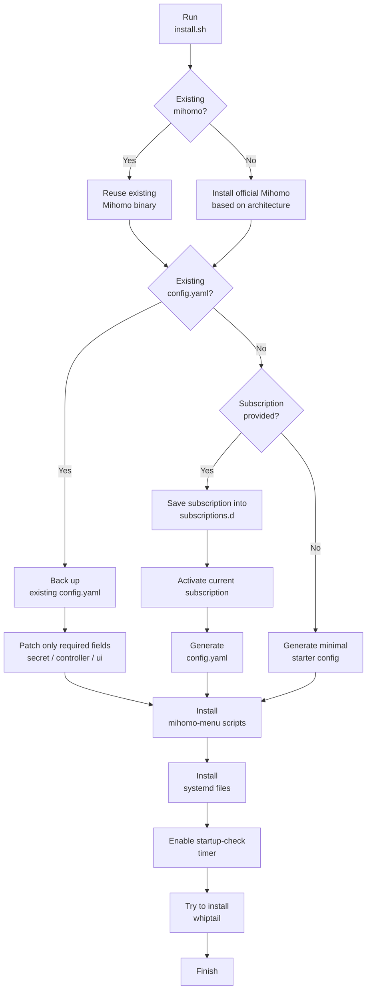

# mihomo-menu

[中文 README](./README.md) | [English README](./README_EN.md)

`mihomo-menu` is a CLI-oriented management toolkit for Mihomo on Linux servers.

This project exists for a very practical reason:

- many servers only have SSH and no desktop environment
- `metacubexd` / WebUI is great for switching nodes inside the **current subscription**
- but switching **multiple subscription sources**, testing latency, selecting the fastest node, and running startup health checks are still awkward from plain shell

So this project fills that gap.

## Features

- interactive menu: `mihomo-menu`
- multi-subscription management:
  - `mihomo-sub-add`
  - `mihomo-sub-list`
  - `mihomo-sub-current`
  - `mihomo-sub-use`
- node management:
  - `mihomo-list`
  - `mihomo-current`
  - `mihomo-select`
  - `mihomo-select-index`
- latency testing:
  - `mihomo-delay`
  - supports switching directly to the Nth fastest node
- proxy connectivity test:
  - `mihomo-test`
- WebUI update:
  - `mihomo-ui-update`
- current subscription update:
  - `mihomo-update`
- startup health check:
  - `mihomo-startup-check.sh`
  - `mihomo-startup-check.timer`

## Use Cases

- Ubuntu / Debian / CentOS / Rocky / AlmaLinux / Fedora / Arch / Alpine
- Mihomo managed over SSH
- servers without GUI
- users who want to keep WebUI for node switching, but still want CLI for subscription switching and automation

## One-Line Install

Run this on the target machine:

```bash
curl -fsSL https://raw.githubusercontent.com/sunset-move/mihomo-menu/main/install.sh | sudo bash
```

The installer will:

1. download the repository archive
2. detect whether Mihomo already exists on the system
3. if Mihomo is missing, install the official Mihomo core automatically
4. install scripts into `/usr/local/bin/`
5. install systemd files into `/etc/systemd/system/`
6. create:
   - `/etc/mihomo/subscriptions.d`
   - `/etc/mihomo/secret.key` if missing
7. try to install `whiptail` for a better TUI experience
8. enable the startup health-check timer

### Unattended install with subscription

If you want to pass a subscription during installation:

```bash
curl -fsSL https://raw.githubusercontent.com/sunset-move/mihomo-menu/main/install.sh | \
sudo env MIHOMO_SUBSCRIPTION_NAME=airport1 MIHOMO_SUBSCRIPTION_URL='your subscription URL' bash
```

## Requirements

This project is primarily a management layer, but the installer now does:

1. detect an existing Mihomo binary
2. install the official Mihomo core automatically if missing

There is still an important boundary:

- this toolkit manages subscriptions, node selection, latency testing, and health checks
- it does not magically design your full production rule logic for you

Recommended target environment:

- Mihomo config directory: `/etc/mihomo/`
- Mihomo controller API available
- your own base config / subscription source already planned

### Current automation boundary

The installer now supports:

1. If Mihomo already exists
   - reuse the existing Mihomo binary
   - reuse the existing `/etc/mihomo/config.yaml` as much as possible
   - back it up first, then inject only the fields required by this toolkit

2. If Mihomo does not exist
   - install the official Mihomo core automatically
   - create a default `mihomo.service`

3. If `config.yaml` already exists
   - back it up
   - patch only the minimum required integration fields

4. If `config.yaml` does not exist
   - generate one from the provided subscription, if available
   - otherwise generate a minimal starter config

So in practice:

- **existing environment**: reuse and integrate
- **no existing environment**: bootstrap a runnable base setup automatically

### Installation Flowchart



## Project Structure

```text
scripts/
  mihomo-menu.sh
  mihomo-main-group.py
  mihomo-list.sh
  mihomo-current.sh
  mihomo-select.sh
  mihomo-select-index.sh
  mihomo-delay.py
  mihomo-test.sh
  mihomo-sub-add.sh
  mihomo-sub-list.sh
  mihomo-sub-current.sh
  mihomo-sub-use.sh
  mihomo-sub2config.py
  mihomo-update.sh
  mihomo-ui-update.sh
  mihomo-startup-check.sh

systemd/
  mihomo-startup-check.service
  mihomo-startup-check.timer
```

## Quick Start

### 1. Add your first subscription

```bash
mihomo-sub-add airport1 'your subscription URL'
```

### 2. Switch to it

```bash
mihomo-sub-use airport1
```

### 3. Open the interactive menu

```bash
mihomo-menu
```

### 4. Test latency manually

```bash
mihomo-delay --timeout 4000
```

### 5. Switch to the fastest node

```bash
mihomo-delay --timeout 4000 --select 1
```

## WebUI vs This Project

`metacubexd` / WebUI is good for:

- viewing the current node
- switching nodes inside the current subscription
- checking connections
- reading logs
- monitoring traffic

But it is **not ideal for switching between multiple subscription sources**.

Why?

Because switching subscriptions is not only about selecting another node. It usually means:

1. replacing the current subscription source
2. regenerating `config.yaml`
3. restarting Mihomo

So the intended split is:

- node-level operations: WebUI
- subscription-source switching: `mihomo-menu` / `mihomo-sub-use`

## Supported Subscription Formats

Current scripts support:

1. raw `base64 + vmess://...` subscriptions
2. full `Clash YAML` subscriptions

It does **not** guarantee support for every possible future format, especially mixed or newer schemes such as:

- `vless://`
- `trojan://`
- `hysteria://`
- `tuic://`

If needed, extend `mihomo-sub2config.py`.

## Menu Modes

`mihomo-menu` supports two interaction modes:

1. if `whiptail` is available
   - it uses a dialog-style TUI
   - less flicker
   - supports arrow keys

2. if terminal capability is poor
   - it falls back to a plain numeric menu
   - still usable in minimal environments

For node selection:

- arrow key selection is supported
- recent latency is shown
- `Esc` exits the dialog

## Startup Health Check

After installation, the timer is enabled:

- `mihomo-startup-check.timer`

Log file:

```text
/var/log/mihomo-startup-check.log
```

Run it manually:

```bash
sudo systemctl start mihomo-startup-check.service
```

Read logs:

```bash
tail -n 50 /var/log/mihomo-startup-check.log
```

## Common Commands

```bash
mihomo-menu
```

- Open the interactive menu
- Best entry point for most daily operations

```bash
mihomo-sub-list
```

- List all saved subscription sources
- Marks which one is currently active

```bash
mihomo-sub-current
```

- Show the current active subscription name and URL

```bash
mihomo-sub-use airport1
```

- Switch to a specific subscription source
- Automatically regenerates config and restarts Mihomo

```bash
mihomo-list
```

- List nodes in the current primary proxy group
- Uses the original list order numbering

```bash
mihomo-current
```

- Show the currently selected node

```bash
mihomo-delay --timeout 4000
```

- Test latency for all nodes in the current group
- Ranking only, no switching

```bash
mihomo-delay --timeout 4000 --select 1
```

- Run latency tests
- Then automatically switch to the fastest node

```bash
mihomo-test
```

- Test whether the current proxy is working
- Usually checks `https://www.google.com/generate_204`

```bash
mihomo-update
```

- Update the current active subscription
- Regenerate config and restart Mihomo

```bash
mihomo-ui-update
```

- Update `metacubexd` WebUI static assets

## Security Notes

- do not commit real subscription URLs into a public repository
- do not commit `/etc/mihomo/secret.key`
- do not publish generated full node configs publicly

## License

MIT
